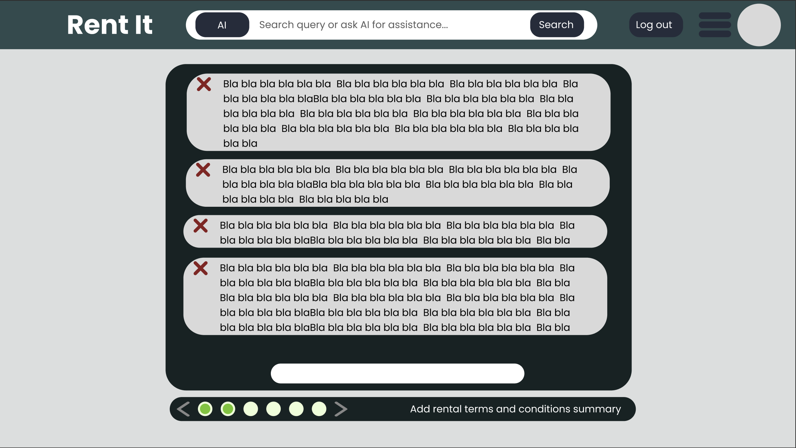

# Project Title

Rent It

## Overview

Rent It is a web platform that connects renters and rentees, offering a streamlined, automated workflow that empowers users to transact with confidence.

### Problem Space

Rent It addresses two primary user needs:

Asset Owners (Renters)
You’ve purchased valuable assets that are underutilized—formal wear, machinery, seasonal equipment, etc.—and you want to generate income from them.

Asset Seekers (Rentees)
You need temporary access to assets without the burden of ownership. Whether it’s a snowblower for the winter, a tuxedo for an event, or specialized tools, you seek affordable, low-risk solutions.

Rent It provides a trusted, user-friendly environment for these transactions, supported by an automated workflow that may include:

- Asset advertising
- Smart questionnaires
- Messaging and texting
- Document sharing
- Contract creation and e-signing
- Cellphone-based inspections
- Financial transaction brokering

...and potentially more as the platform evolves.

### User Profile

- Renters
    - Aim to earn income from assets they own.
    - Often entrepreneurs or individuals seeking passive income.
- Rentees
    - Need temporary access to assets.
    - Prefer low-cost, low-commitment solutions.

### Features

- Search rental ads using keywords.
- Get AI assistance when unsure what to search for.
- View rental listings with clear, consistent details.
- Follow a standardized workflow to post rental assets.
- Upload images and media when posting an asset.
- Specify custom terms and conditions for each listing.
- Access background checks, rental histories, and credit documents for prospective rentees.
- Conduct pre- and post-rental camera inspections of assets.
- Share, review, and sign contracts digitally.
- Chat easily with renters and share documents.
- Manage rental assets through a summary dashboard with status updates and detailed views.
- Manage rented assets with similar ease and visibility

## Implementation

### Tech Stack

- Frontend:
    - React
    - JavaScript
    - Libraries:
        - react
        - react-router
        - axios
        - uuid
        - sass
        - react-pdf or pdf.js
- Backend:
    - Express
    - MySQL
    - Libraries:
        - knex
        - bcrypt (for password hashing)

### APIs

- OpenAI API or equivalent (for AI assistance).
- MediaDevice API or equivalent (for inspections and media handling).
- Stripe API or equivalent (optional, for payment processing).
- ESIGN API or equivalent (optional, for digital signatures).

### Sitemap

- Landing Page
- Asset Details Page
- Sign Up
- Log In
- Manage Rented Assets
- Manage Assets for Rent
- Post an Asset (multi-step):
    - Upload Images
    - Add Details
    - Review Documents
    - Camera-Based Inspection

### Mockups

#### Landing Page:

#### Asset Details Page:

#### Sign up:

#### Sign up Email Confirmation:

#### Login:

#### Login MFA:

#### Landing Page Signed in:

#### Landing Page Expanded Menu:

#### Rent Management:

#### Rent Management with History:

#### Rented Management:

#### Rented Management with History:

#### Rental Ad Page 1, Photo and Media Upload:

#### Rental Ad Page 1, With Photo and Media Upload:

#### Rental Ad Page 2, Ad Tags:

#### Rental Ad Page 3, Contract Terms and Conditions Summary:

#### Rental Ad Page 4, Contract Upload:

#### Rental Ad Page 5, Camera Inspection:

#### Rental Ad Page 6, Ad Review Page:

#### Chat and Notifications:

### Data

Describe your data and the relationships between the data points. You can show this visually using diagrams, or write it out. 

### Endpoints

List endpoints that your server will implement, including HTTP methods, parameters, and example responses.

## Roadmap

Scope your project as a sprint. Break down the tasks that will need to be completed and map out timeframes for implementation working back from the capstone due date. 

---

## Future Implementations
Your project will be marked based on what you committed to in the above document. Here, you can list any additional features you may complete after the MVP of your application is built, or if you have extra time before the Capstone due date.

Missing Legal/Compliance Considerations

For a service handling payments, identity verification, contracts, and inspections, mention of GDPR/CCPA compliance and liability frameworks would strengthen the proposal.

Optional but Beneficial

Trust & Safety Features: Fraud detection, insurance integration.

Mobile App Consideration: Given camera inspections and messaging, a mobile-first or mobile app approach should be noted.

Admin Dashboard: For dispute management, moderation, and analytics.