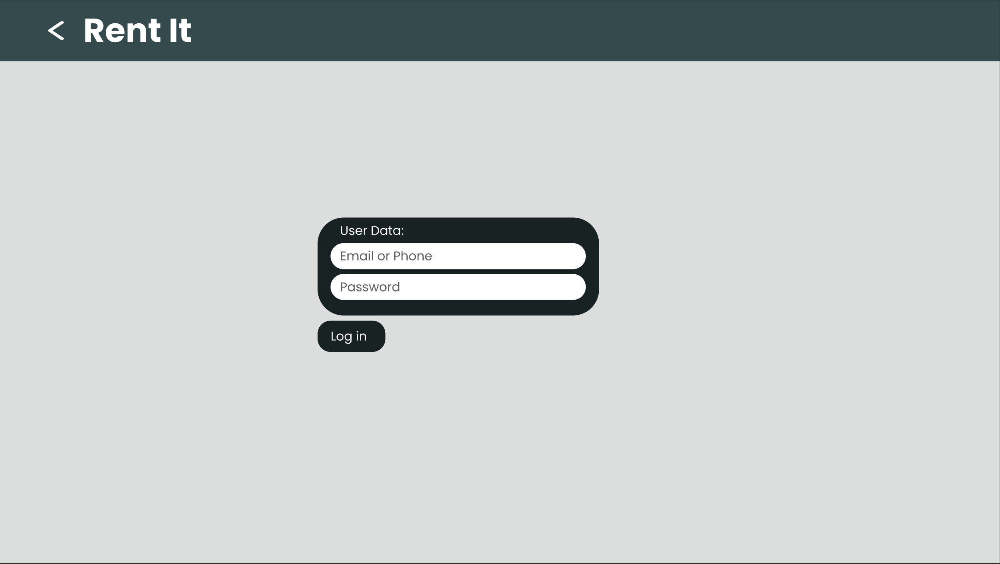

# Project Title

Rent It

## Overview

Rent It connects renters and rentees, offering a streamlined, automated workflow to empower users to transact with confidence.

### Problem Space

Rent It sets out to address two problems from two broad user categories.

First, suppose you purchased an essential asset but don't get much use out of it, making it feel like an unwise purchasing decision. This could be a tuxedo, a snow machine, construction tools, etc. You might also have made such purchases because you're an entrepreneur looking for opportunities. Whatever the circumstances may be, you have an asset and hope to earn a financial return on it.

Second, suppose you need an asset for some period of time, or you are looking for a low-cost, low-risk way of accessing an asset. This could be seasonal decorations (e.g., Christmas decorations), a tuxedo, uncommon machinery, etc.

This is where Rent It shines! Rent It offers a space where both renters and rentees can transact in an efficient user friendly environment. This workflow include procedural wizards automating the process, such process may include advertising, questionnaires, messaging and texting, document sharing, contract establishment, cellphone based inspections, financial transaction brokering, and possibly more. 

### User Profile

- User profile 1 - renters:
    - interested to earn a financial return on a purchased asset. 
    - invested in offering an asset for earning an alternative income source.

- User profile 2 - rentees:
    - needs short term access to an asset.
    - wants a low-risk/low-cost method of accessing an asset. 

### Features
~~notdone~~
#### As a NOT logged in user:
- I want to be able to search for items to rent.
- I view an item I am interested in. 
- 

#### As a logged in user:

~~notdone~~

## Implementation

### Tech Stack

- React
- JavaScript
- MySQL
- Express
- Client libraries: 
    - react
    - react-router
    - axios
    - uuid
    - react-pdf or pdf.js
- Server libraries:
    - knex
    - express
    - bcrypt for password hashing

### APIs

- OpenAI API or similar LLM APIs. 
- MediaDevice API

### Sitemap

- Landing page
- Asset details
- Sign up
- Log in
- Manage rented assets
- Manage assets for rent
- **Post an asset**
    - Upload images
    - Add details (maybe multi step)
    - Review document 
    - Camera based inspection 

### Mockups

#### Landing Page:

#### Asset Details Page:

#### Sign up:

#### Sign up Email Confirmation:

#### Login:

#### Login MFA:

#### Landing Page Signed in:

### Data

Describe your data and the relationships between the data points. You can show this visually using diagrams, or write it out. 

### Endpoints

List endpoints that your server will implement, including HTTP methods, parameters, and example responses.

## Roadmap

Scope your project as a sprint. Break down the tasks that will need to be completed and map out timeframes for implementation working back from the capstone due date. 

---

## Future Implementations
Your project will be marked based on what you committed to in the above document. Here, you can list any additional features you may complete after the MVP of your application is built, or if you have extra time before the Capstone due date.